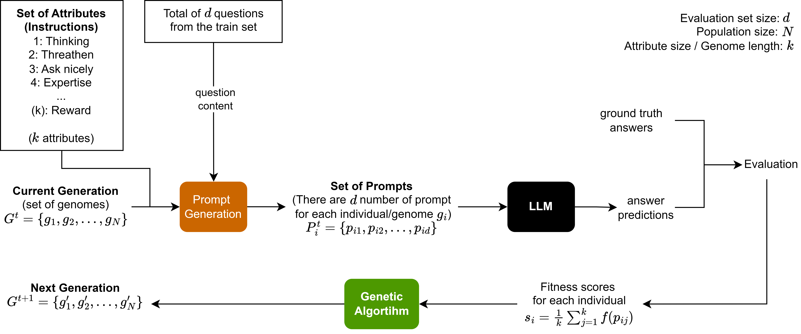
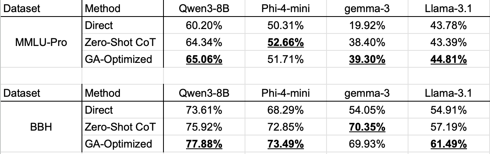
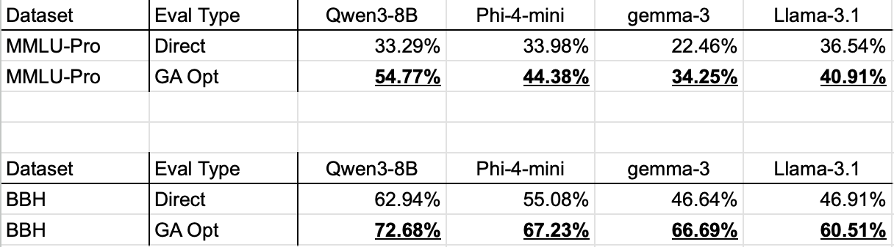
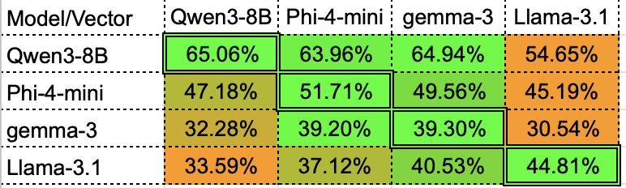
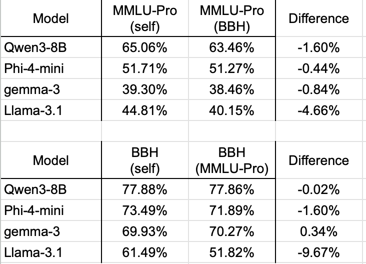

# Evolutionary Prompt Optimization for LLMs

**Research Internship Project | TUM - Computer Aided Medical Procedures (CAMP)**

This repository contains the code and results from my summer research internship at the Technical University of Munich (TUM). The project focuses on automating prompt engineering using **Genetic Algorithms (GA)** to optimize system instructions for Large Language Models (LLMs).

## 📄 Project Overview

Manual prompt engineering is time-consuming and often unintuitive. This project proposes an evolutionary approach where a "population" of prompts evolves over generations to maximize performance on reasoning benchmarks (MMLU-Pro and BBH).

### The Pipeline
The system treats prompt instructions as a genome. A binary vector represents the activation of specific prompt attributes (e.g., "Chain of Thought", "Persona: Expert", "Conciseness").


*Figure 1: The Evolutionary Pipeline. A binary genome is mapped to a text prompt, generated by the LLM, evaluated against ground truth, and evolved via crossover and mutation.*

## 🛠️ Methodology

The core logic utilizes the **DEAP** library for evolutionary computation and **vLLM** for high-throughput inference.

*   **Gene Pool:** defined in `src/attributes_llm.py`, containing 40+ distinct prompt strategies (Role-playing, CoT, Formatting constraints, Emotional stimuli).
*   **Optimization:** The GA (in `src/ga_vllm_opt.py`) evolves the population to maximize accuracy on a training subset of MMLU/BBH.
*   **Models Evaluated:** Qwen3-8B, Phi-4-mini, Gemma-3, and Llama-3.1.

## 📊 Results & Analysis

The efficacy of the evolutionary prompt optimization was evaluated across five distinct dimensions: reasoning under standard conditions, performance under strict token constraints, robustness to structured formatting (JSON), and generalization across both different models and different datasets.

### 1. Standard Benchmark (Natural Language, 2048 Tokens)
*File: `results/natural_2048.png`*

This benchmark represents the "optimal" performance scenario, allowing models a high token budget for reasoning and natural language expression. We compared the **GA-Optimized** prompt against standard **Direct Prompting** and **Zero-Shot Chain-of-Thought (CoT)**.



**Key Observations:**
* **Superiority of GA:** The GA-Optimized prompt consistently outperformed both Direct and CoT baselines across all models.
* **Significant Gains:** On the BBH dataset, **Qwen3-8B** improved from **73.61% (Direct)** to **77.88% (GA)**. Similarly, **Llama-3.1** saw a jump from **54.91%** to **61.49%**.
* **CoT Consistency:** While CoT generally helps, the GA-evolved prompts found even more effective instruction combinations than the standard "Let's think step by step."

---

### 2. Token-Budgeted Performance (Natural Language, 512 Tokens)
*File: `results/natural-512.png`*

In many production environments, inference cost and latency are limited by a token budget. We evaluated performance when the model response was capped at 512 tokens.


**Key Observations:**
* **Efficiency:** Even with a restricted budget, GA-Optimized prompts provided a massive lift over baseline performance.
* **Qwen Excellence:** On MMLU-Pro, **Qwen3-8B** maintained a commanding lead, jumping from **33.29%** to **54.77%** using optimized instructions.

---

### 3. Structured Output Constraints (JSON, 512 Tokens)
*File: `results/json-512.png`*

Requiring LLMs to output strictly valid JSON often degrades reasoning performance as the model prioritizes formatting over logic. We tested the GA's ability to evolve prompts that maintain high accuracy while adhering to a strict JSON format within 512 tokens.



**Key Observations:**
* **Balancing Act:** The GA successfully evolved prompts that enforced valid JSON syntax without collapsing the reasoning chain.
* **Outperforming "Concise CoT":** For **BBH**, the GA-Optimized Qwen3-8B reached **75.48%**, outperforming the specialized "Zero-Shot CoT + Concise" baseline (73.81%).

---

### 4. Cross-Model Transferability
*File: `results/cross-model.png`*

We analyzed the "universality" of optimized prompts by taking instructions evolved for one model (**Source**) and evaluating them on other models (**Target**).


*(Rows: Source model used for GA optimization | Columns: Target model evaluated)*

**Key Observations:**
* **Universal Patterns:** Prompts optimized on **Qwen3-8B** (top row) generalized remarkably well to Phi-4 and Gemma-3 (shown in bright green). This suggests Qwen discovers reasoning strategies that are effective for other architectures.
* **Model Specificity:** Prompts optimized for **Llama-3.1** (bottom row) showed poor transferability to others (orange cells), indicating that the GA over-fitted to Llama's unique response style.

---

### 5. Cross-Dataset Transferability (Generalization)
*File: `results/cross-dataset.png`*

To ensure the GA was evolving general reasoning strategies rather than just "memorizing" a specific dataset, we tested prompts optimized on MMLU-Pro on the BBH dataset, and vice versa.



**Key Observations:**
* **Robustness:** **Qwen3-8B** demonstrated incredible stability; a prompt optimized for BBH performed almost identically when applied to MMLU-Pro (only a **-0.02%** difference).
* **Dataset Sensitivity:** **Llama-3.1** showed the highest sensitivity, with a **-9.67%** drop when switching datasets, suggesting its optimized instructions were highly specific to the BBH task format.

## 💻 Usage

### Requirements
*   Python 3.10+
*   CUDA-compatible GPU (High VRAM recommended for vLLM)

```bash
pip install -r requirements.txt
```

## 📂 Repository Structure

*   `ga_vllm_opt.py`: The main script running the Genetic Algorithm using DEAP and vLLM.
*   `attributes_llm.py`: Contains the "Gene Pool"—the dictionary of prompt instructions, prefixes, and styles used to construct the genome.
*   `eval_cot.py`: Evaluation pipeline for benchmarking models against MMLU-Pro and BBH using various prompting strategies (Zero-Shot, Few-Shot, CoT).
*   `utils.py`: Helper functions for GPU detection, memory management, and parsing JSON answers from LLM outputs.
*   `results/`: Contains visualizations of the experiments, including the pipeline diagram, transferability heatmaps, and performance tables.

## Acknowledgments

This research was conducted during my internship at the **Computer Aided Medical Procedures (CAMP)** Chair at **Technical University of Munich (TUM)**. I would like to thank my supervisors for their mentorship and support throughout this project.
